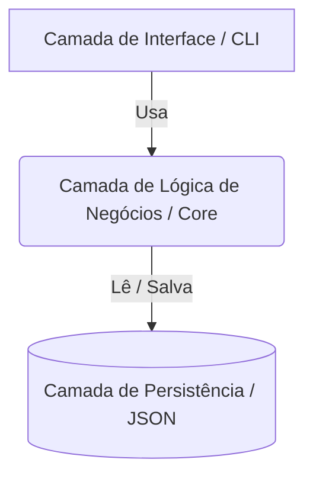
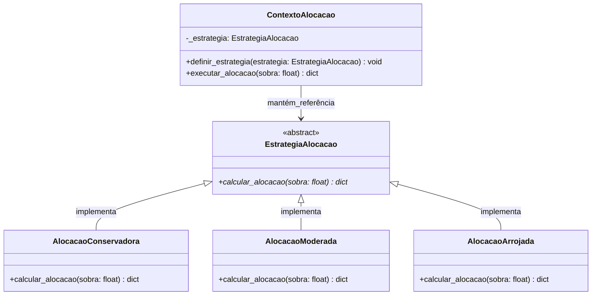

# Projeto da Aplicação e Arquitetura — InvestPlan

## 1. Registro de Decisões Arquiteturais (ADR) e Histórico

Para garantir o rastreamento das decisões e o alinhamento com os requisitos de engenharia, todas as mudanças estruturais e padronizações estão registradas abaixo:

| Data | Decisão / Alteração | Motivo e Trade-offs | Responsável |
|---|---|---|---|
| 30/05/2026 | Definição do Padrão Strategy para Alocação | Necessidade de evitar estruturas condicionais complexas e permitir fácil expansão de novos perfis no futuro. | Felipe |
| 30/05/2026 | Isolamento da Lógica de Negócios (Core) | Separar a matemática financeira da interface do terminal (CLI) para viabilizar testes automatizados isolados na Sprint 4. | Felipe |
| 30/05/2026 | Adoção de Clean Code estritamente funcional | Proibição de comentários em linha para forçar a equipe a usar nomes de variáveis autodescritivas. | Felipe |

---

## 2. Padrões de Codificação e Gestão de Qualidade

> **Responsável:** Felipe (Clean Code), Elder (Controle de Versão), Guilherme (Tipagem e Tratamento de Erros)

### 2.1 Diretrizes de Clean Code e Nomenclatura (Felipe)
O código base do InvestPlan deve ser estritamente funcional, limpo e autodocumentado. Para garantir o mais alto nível de legibilidade e manutenção, a equipe deve seguir rigorosamente as seguintes regras na escrita do código Python:

* **Proibição de Comentários em Linha:** O código não deve conter comentários explicativos em linha ou cabeçalhos descritivos no topo dos arquivos. Se um trecho de código precisa de um comentário para ser entendido, ele deve ser refatorado.
* **Nomenclatura Autodescritiva:** A clareza do sistema dependerá inteiramente dos nomes escolhidos. Variáveis, funções e classes devem revelar exatamente sua intenção (ex: usar `calcular_capacidade_poupanca()` em vez de `calc_cp()`).
* **Funções de Responsabilidade Única (SRP):** Cada função deve realizar apenas uma operação. Funções extensas devem ser quebradas em métodos menores.

*(Espaço reservado para o Elder adicionar Git Flow e o Guilherme adicionar Type Hinting)*

---

## 3. Diagrama de Arquitetura e Trade-offs

A arquitetura do InvestPlan adota uma separação por camadas estruturais (Layered Architecture) para isolar a interface de texto, a lógica financeira e a persistência de arquivos.

### 3.1 Camada de Lógica de Negócios / Core (Responsável: Felipe)
Esta camada é o "motor" do InvestPlan, responsável por processar os cálculos orçamentários, avaliar os pesos do questionário de risco e aplicar a matemática de alocação e projeção de juros (conforme regras RN-01 a RN-08).

* **Trade-off Justificado:** Optamos por um isolamento total e rigoroso desta camada em relação à camada de interface (CLI). Nenhuma classe de negócios possui comandos de `print()` ou `input()`. O *trade-off* dessa decisão é um leve aumento na verbosidade estrutural, exigindo a passagem de objetos e retornos formatados entre os arquivos. No entanto, essa escolha é justificada porque permite que toda a matemática financeira seja testada de forma isolada através do módulo `unittest` na Sprint 4, garantindo a confiabilidade dos cálculos do sistema sem depender da interação do usuário.

*(Espaço reservado para o Elder justificar a Interface CLI e o Guilherme justificar a Persistência Local)*

---

## 4. Padrões de Projeto

O sistema faz uso intencional de Padrões de Projeto (Design Patterns) para resolver problemas recorrentes de engenharia de software de forma limpa e escalável.

### 4.1 Padrão Strategy: Módulo de Alocação (Responsável: Felipe)
O padrão comportamental **Strategy** foi escolhido para encapsular os diferentes algoritmos de recomendação de investimentos do InvestPlan.

* **Problema a ser resolvido:** O sistema precisa recomendar alocações percentuais diferentes baseadas na sobra financeira e no perfil de risco do usuário (Conservador, Moderado, Arrojado). Fazer isso através de longas cadeias de `if/else` tornaria o código frágil e difícil de testar.
* **Solução e Classes Reais:** Criamos uma interface base/classe abstrata chamada `EstrategiaAlocacao` que define o contrato obrigatório `calcular_alocacao(sobra: float)`. Criamos classes concretas que herdam dessa base: `AlocacaoConservadora`, `AlocacaoModerada` e `AlocacaoArrojada`. Cada uma possui sua própria regra matemática injetada. O contexto do sistema avalia o resultado do questionário do usuário (HU-02) e instancia dinamicamente apenas a estratégia correta (HU-03).
* **Benefício Arquitetural:** O módulo fica aberto para extensão e fechado para modificação (Princípio OCP do SOLID). Se no futuro decidirmos criar um perfil "Ultra-Arrojado", basta adicionar uma nova classe, sem risco de quebrar o código dos perfis já existentes.

### 4.1.1 Diagrama de Classes UML (Strategy)

### 4.1.2 Detalhamento dos Módulos e Atributos Reais do Código

* **`ContextoAlocacao`:** Classe que interage com a interface de comando. Contém o estado da alocação e delega a computação dos percentuais à estratégia ativa que foi injetada após a avaliação do questionário.
* **`EstrategiaAlocacao`:** Interface abstrata que dita o contrato padrão para todos os algoritmos de cálculo. Garante que qualquer nova estratégia implemente o método de cálculo de forma consistente.
* **Classes Concretas (`AlocacaoConservadora`, `AlocacaoModerada`, `AlocacaoArrojada`):** Contêm os coeficientes matemáticos específicos de cada perfil de risco (conforme a regra RN-07), processando o valor numérico da sobra orçamentária e devolvendo um dicionário estruturado com as quantias exatas destinadas a cada ativo.

*(Espaço reservado para o Elder documentar o Facade e o Guilherme documentar o Singleton)*